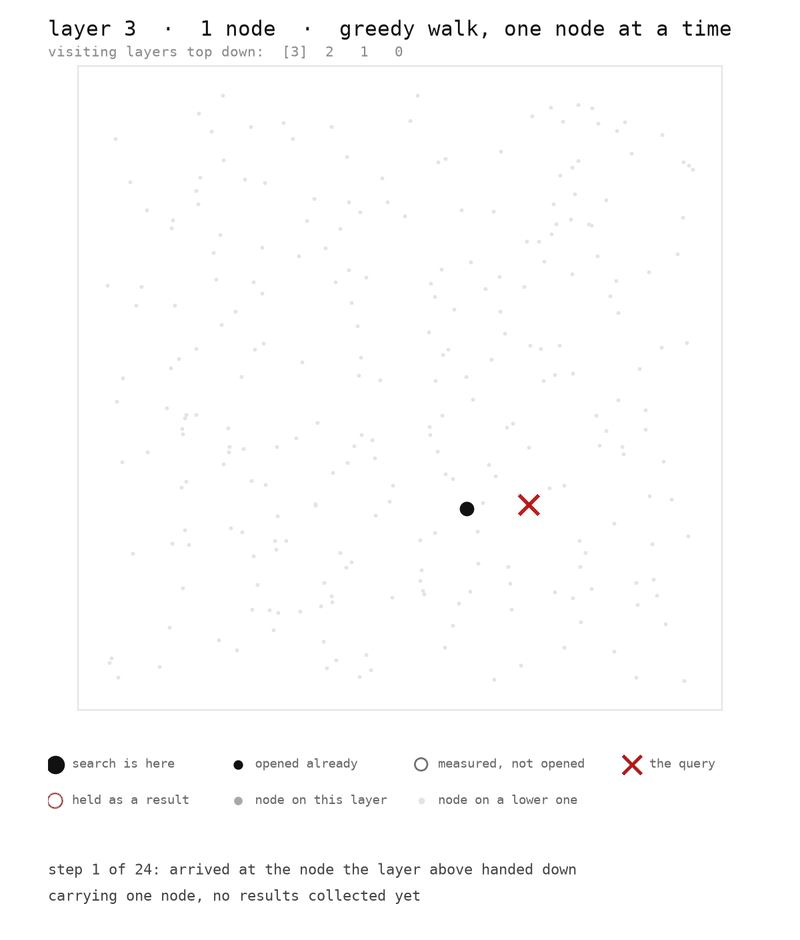

# HNSW

Approximate nearest neighbour search, written from scratch in C++17 with no
dependencies.



## Build

```bash
cmake -S . -B build && cmake --build build
./build/test
```

## Results

Measured on SIFT1M, a million image descriptors with published correct answers.
Each of 1,000 queries asks for the ten nearest vectors, and recall is the
fraction of those ten the search actually found. The index was built with
`M=16` and `efConstruction=200`.

| efSearch | recall@10 | queries/sec |
|---|---|---|
| 16 | 0.8032 | 30,792 |
| 32 | 0.9028 | 20,053 |
| 48 | 0.9443 | 14,733 |
| 64 | 0.9623 | 11,631 |
| 128 | 0.9883 | 6,133 |
| 320 | 0.9977 | 2,902 |

Exhaustive search over the same data runs at 126 queries per second. The index
builds in 45 seconds on all cores, occupies 630 MB, and averages 26 links per
vector across 5 layers.

```bash
./build/bench data/sift sift
```

Vectors are from the SIFT1M benchmark, `corpus-texmex.irisa.fr`. Extract `sift/`
into `data/`.

## Layout

```
src/distance.h   scalar and NEON squared L2
src/dataset.*    flat vector storage, fvecs parsing, clustered test data
src/hnsw.*       the index
src/eval.*       exhaustive search and recall
tests/           save, mmap, and the threaded build
bench/           the recall and throughput sweep
tools/draw.cpp   emits an SVG of the layers
```
